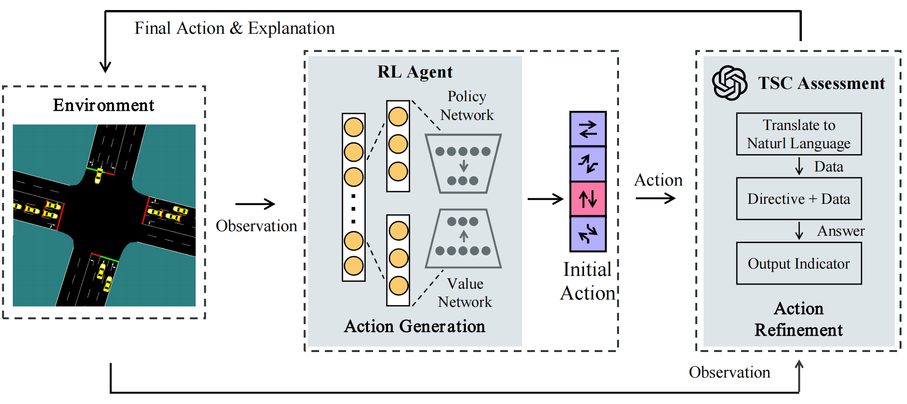
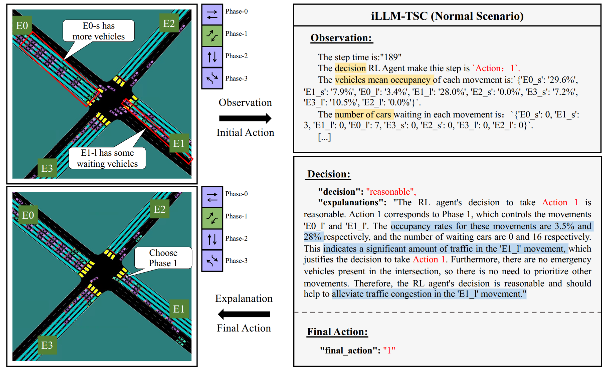
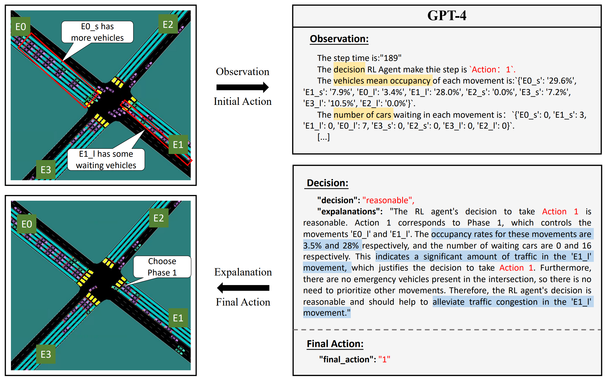
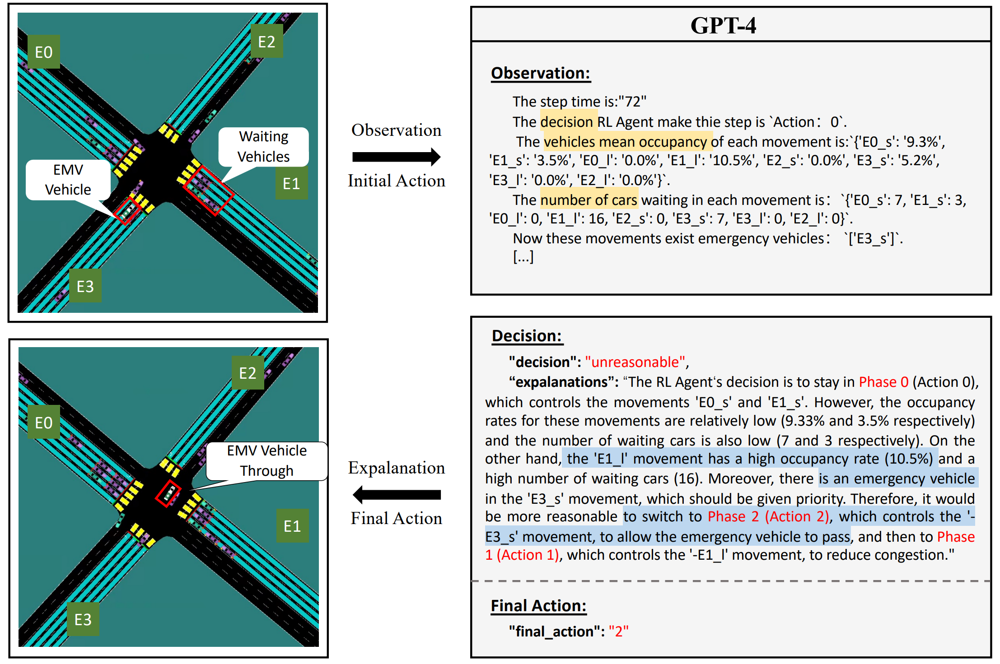
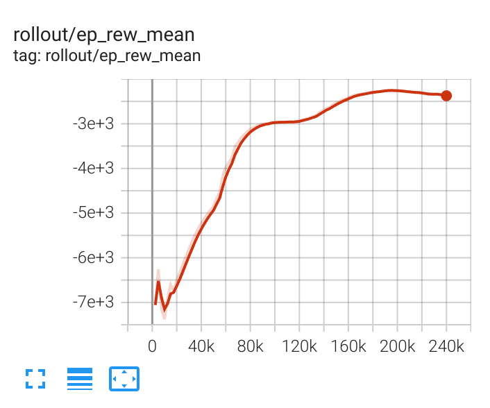

# iLLM-TSC: Integration reinforcement learning and large language model for traffic signal control policy improvement

## [Paper](https://arxiv.org/abs/2407.06025) | [Simulation](https://github.com/Traffic-Alpha/TransSimHub) |
## iLLM-TSC's powerful capabilities

https://github.com/Traffic-Alpha/TSC-HARLA/assets/75999557/92d6ff7f-cc5b-42ba-9feb-046022e70ad9


## Info
We propose a framework that utilizes LLM to support RL models. This framework refines RL decisions based on real-world contexts and provides reasonable actions when RL agents make erroneous decisions. 

<div align=center>


The detailed structure of iLLM-TSC.
</div>


## Typical Cases

- Case1: LLM think that the action taken by the RL Agent was unreasonable and gave a reasonable explanation and recommended actions.
<div align=center>



</div>

- Case 2: LLM considers that the movement made by the RL Agent is not the movement with the highest current mean occupancy but it is reasonable, after which LLM gives an explanation and recommendation.
<div align=center>

</div>

- Case 3: An ambulance needs to pass through the intersection, but the RL Agent does not take into account that the ambulance needs to be prioritized. LLM modifies the RL Agent’s action to prioritize the ambulance to pass through the intersection.
<div align=center>

</div>

## Install

### Install [TransSimHub](https://github.com/Traffic-Alpha/TransSimHub)
The simulation environment we used is TransSimHub, which is based on SUMO and can be used for TSC, V2X and UAM simulation. More information is available via [docs](https://transsimhub.readthedocs.io/en/latest/).

You can install TransSimHub by cloning the GitHub repository. Follow these steps:
```bash
git clone https://github.com/Traffic-Alpha/TransSimHub.git
cd TransSimHub
pip install -e .
```

After the installation is complete, you can use the following Python command to check if TransSimHub is installed and view its version:

```bash
import tshub
print(tshub.__version__)
```

###  Install HARLA
You can install HARLA by cloning the GitHub repository. Follow these steps:
```bash
git clone https://github.com/Traffic-Alpha/TSC-HARLA
cd TSC-HARLA
pip install -r requirements.txt
```
After completing the above ``Install steps``, you can use this program locally. 
## Run HARLA locally
### Train RL
The first thing you need to do is train a RL model. You can do it with the following code:
```bash
cd TSC-HARLA
python sb3_ppo.py
```
The training results are shown in the figure, and model weight has been uploaded in [models](./models/). 

<div align=center>

</div>

The effect of the RL model can be tested with the following code:
```bash
python eval_rl_agent.py
```
### Try RL+LLM
Before you can use LLM, you need to have your own KEY and fill it in the [``utils/config.yaml``](./utils/config.yaml). 
```bash
OPENAI_PROXY: 
OPENAI_API_KEY:
```
The entire framework can be used with the following code.
```bash
python rl_llm_tsc.py
```


**Evaluation Rule: To make fair evaluation and comparison among different models, make sure you use the same LLM evaluation model (we use GPT4) for all the models you want to evaluate. Using a different scoring model or API updating might lead to different results.**

## License and Citation
All assets and code in this repository are under the [Apache 2.0 license](./LICENSE) unless specified otherwise. The language data is under [CC BY-NC-SA 4.0](https://creativecommons.org/licenses/by-nc-sa/4.0/). Other datasets (including nuScenes) inherit their own distribution licenses. Please consider citing our project if it helps your research.
```BibTeX
@article{pang2024illm,
  title={iLLM-TSC: Integration reinforcement learning and large language model for traffic signal control policy improvement},
  author={Pang, Aoyu and Wang, Maonan and Pun, Man-On and Chen, Chung Shue and Xiong, Xi},
  journal={arXiv preprint arXiv:2407.06025},
  year={2024}
}
```
```BibTeX
@article{wang2024llm,
  title={LLM-Assisted Light: Leveraging Large Language Model Capabilities for Human-Mimetic Traffic Signal Control in Complex Urban Environments},
  author={Wang, Maonan and Pang, Aoyu and Kan, Yuheng and Pun, Man-On and Chen, Chung Shue and Huang, Bo},
  journal={arXiv preprint arXiv:2403.08337},
  year={2024}
}
```


## More Projects
iLLM-TSC just explores the combination of RL and LLM, more work will be updated in [**TSC-LLM**](https://github.com/Traffic-Alpha/TSC-LLM), welcome to star!

## Acknowledgment

- **Yufei Teng**: Thanks for editing the video.
- **Thank you to everyone who pays attention to our work. Hope our work can help you.**
