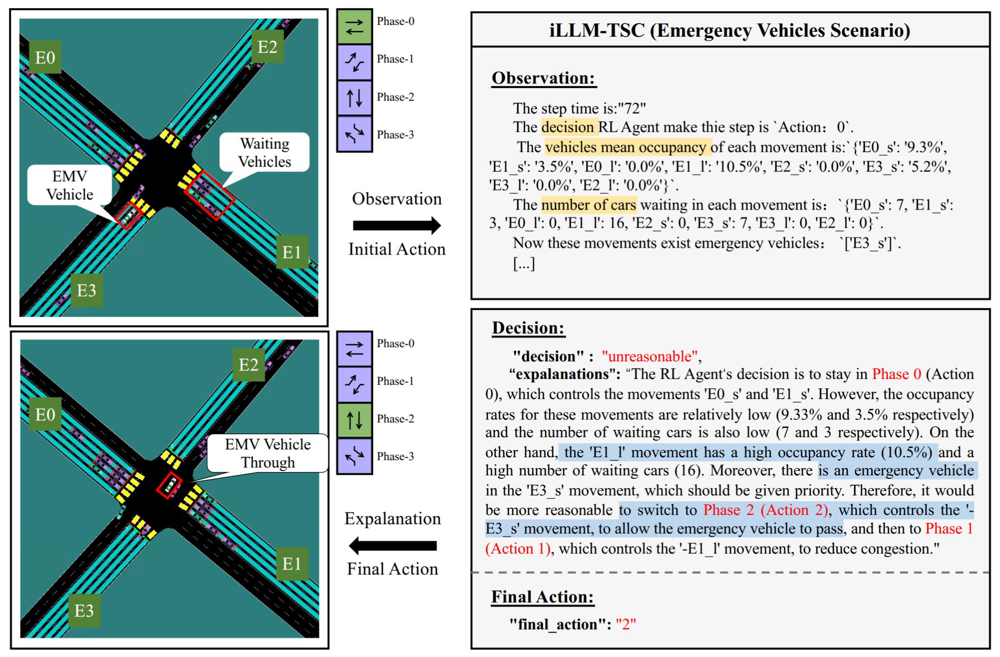
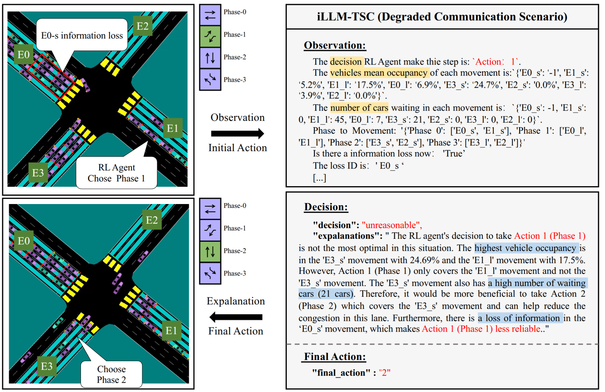

# Human-like Assessment of RL Actions: Leveraging Large Language Models for RL Actions in Traffic Signal Control Systems

## HARLA's powerful capabilities

https://github.com/Traffic-Alpha/TSC-HARLA/assets/75999557/db981004-bd33-41e7-8865-396af1ef0cd9

## Info
We propose a framework that utilizes LLM to support RL models. This framework refines RL decisions based on real-world contexts and provides reasonable actions when RL agents make erroneous decisions. 

<div align=center>


The detailed structure of HARLA.
</div>


## Typical Cases

- Case1: LLM think that the action taken by the RL Agent was unreasonable and gave a reasonable explanation and recommended actions.
<div align=center>


</div>

- Case 2: LLM considers that the movement made by the RL Agent is not the movement with the highest current mean occupancy but it is reasonable, after which LLM gives an explanation and recommendation.
<div align=center>

</div>

- Case 3: An ambulance needs to pass through the intersection, but the RL Agent does not take into account that the ambulance needs to be prioritized. LLM modifies the RL Agent’s action to prioritize the ambulance to pass through the intersection.
<div align=center>

</div>


## Run HARLA locally

### Install [TransSimHub](https://github.com/Traffic-Alpha/TransSimHub)
TransSimHub is used for simulation of the environment, can learn more about from [docs](https://transsimhub.readthedocs.io/en/latest/)

```bash
git clone https://github.com/Traffic-Alpha/TransSimHub.git
cd TransSimHub.git
pip install -e .
```

TransSimHub installation can be checked:

```bash
import tshub
print(tshub.__version__)
```

### Get HARLA
```bash
git clone https://github.com/Traffic-Alpha/TSC-HARLA
cd TSC-HARLA
```

### RL Model Training

```bash
python sb3_ppo.py
```
### Try RL+LLM

```bash
python rl_llm_tsc.py
```

**Evaluation Rule: To make fair evaluation and comparison among different models, make sure you use the same LLM evaluation model (we use GPT4) for all the models you want to evaluate. Using a different scoring model or API updating might lead to different results.**
